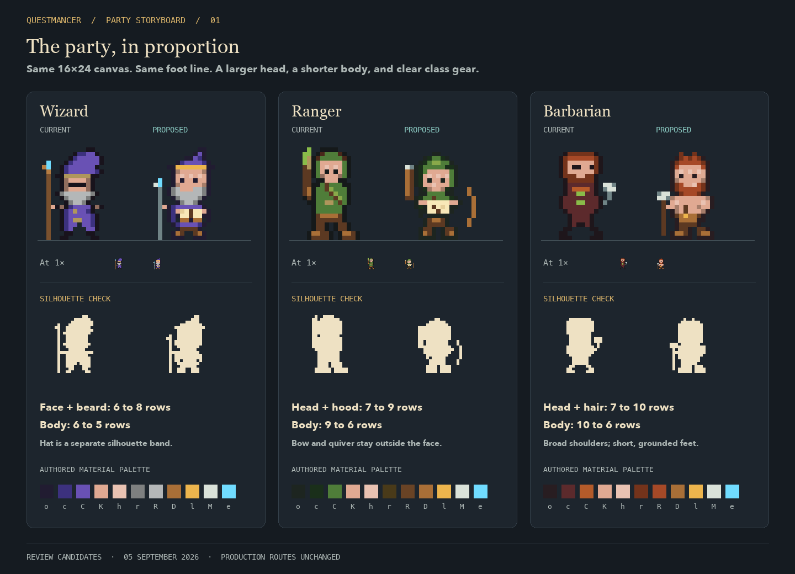

# Three adventurers, in proportion

Date: 2026-09-05
Status: step 1 complete; storyboard direction and corrected proportions
visually approved on 2026-09-05.

This is the static storyboard for the approved
[party delight plan](../../../plans/2026-09-05-party-delight.md). It starts with
the long-torso problem: larger faces and heads, shorter bodies, clear class
gear and grounded feet inside the existing `16x24` world frame.

## Review order

| Sheet | Review purpose |
| --- | --- |
| [01 — Proportions](01-proportions.png) | Current and proposed Wizard, Ranger and Barbarian; enlarged colour, flat silhouettes and literal 1x examples |
| [02 — Moments](02-moments.png) | Two working frames, counsel, resumed work, returned spoils, rest, unknown, settled completion and departure |
| [03 — World context](03-world-context.png) | Current and proposed figures in the Guild Hall and Delve |
| [04 — Card and labels](04-card-and-labels.png) | Existing nameplates and parchment card space around the proposed figures |
| [05 — Small scale](05-small-scale.png) | Three backgrounds, independent `8x12` roster studies, ANSI-16 conversion and shared state cues |
| [06 — Portrait continuity](06-portrait-continuity.png) | Current `24x32` portrait fallbacks beside the world and roster studies |



Start with sheet 01 at enlarged scale, then inspect its 1x examples and the
figures in both rooms. The silhouettes should identify the classes before
their labels are read. The Questmancer approved the presented direction with
“Way better! Approved”. This is static art approval; production playback and
terminal acceptance remain later checks.

## Accepted proportion decisions

| Class | Head allocation, current → proposed | Body allocation, current → proposed | Recognition anchor |
| --- | --- | --- | --- |
| Wizard | Face and beard: 6 → 8 rows | 6 → 5 rows | Crooked hat, beard, staff and book |
| Ranger | Head and hood: 7 → 9 rows | 9 → 6 rows | Broad hood, quiver, bow and map |
| Barbarian | Head and hair: 7 → 10 rows | 10 → 6 rows | Copper hair, broad shoulders and axe |

These are art-direction bands, not an automatic anatomy measurement. Hats,
weapons and other projecting gear are not counted as torso. The head/face
allocation aims at the existing roughly 40–50% guide; short feet and minimal
neck keep the body stocky. The Wizard's hat is a separate band.

Every world frame retains the `16x24` canvas and foot row 21, counted from
zero. The horizontal foot anchor stays stable across each class's poses.
Roster studies are separately authored `8x12` frames with foot row 10; they
are not shrunken world art. Proposed palettes use the existing material
vocabulary; persona palette variants still need a later production review.

The current portrait fallbacks retain their older proportions. Sheet 06 makes
that continuity decision visible; these studies do not repaint native cards
or approve a new portrait style.

## Moment and timing brief

| Trigger | Proposed full-motion treatment | Reduced/still treatment |
| --- | --- | --- |
| Herdr reports working | Alternate working A/B every 500 ms: turn a page, check a map or adjust a grip | Working A plus the shared tool cue |
| Herdr reports blocked | A short gesture, initially 250 ms, then hold the shared lantern signal | Static counsel pose and lantern |
| Counsel submission is confirmed | A brief parchment seal only after correlated text and submit acknowledgement; timing to review in the production pilot | Static confirmed message in the parchment |
| A later Herdr working event | Resume the class ritual | Working pose; a delivery receipt alone cannot trigger it |
| Herdr reports done | Lift the returned object at 0–250 ms, set it down at 250–1200 ms, settle by 2000 ms; remain within the existing three-second window | Static completed pose and shared completion cue |
| Herdr reports idle | Calm rest with gear stowed | Same static rest pose |
| Herdr reports unknown | Static uncertain-state cue | Same static cue; no invented success or urgency |
| Adventurer exits | Remove the actor and its live label/hit region | Same absence; departure has no completion flourish |

The sheets show key poses, not finished animation playback. Silhouette
approval is recorded; intermediate gesture frames remain pilot work. Resumed
work deliberately reuses working B. The folio, map and parcel are metaphors
for returned work, with no inventory, review approval or test result implied.

A newer state, disconnection or departure interrupts old transition theatre.
Reconnect must not replay a completed return. Resting, blocked, unknown and
settled completion do not acquire a recurring decorative wakeup. Counsel
continues to mean only text explicitly composed by the Questmancer with `r`.

## Native frames and sources

[native-frames.png](native-frames.png) is a literal `128x72` transparent sheet:
Wizard, Ranger and Barbarian rows, with eight `16x24` frames in this order:
working A, working B, counsel, resumed, spoils, resting, unknown, settled.
Open at 100% for 1x inspection; fit-to-window zoom changes the apparent scale.

- [candidates.json](candidates.json) is the editable source: 24 world frame
  entries, three roster studies and five shared `5x5` markers.
- [export.rs](export.rs) decodes those pixels through production
  `indexed_sprite`, exports current masters and portrait fallbacks, and uses
  production Storybook fixtures, scene painters and the half-block adapter.
- [layout.py](layout.py) typesets the static PNG review documents from those
  exports with nearest-neighbour enlargement.
- [regenerate.sh](regenerate.sh) builds the library, compiles the exporter with
  warnings denied, validates the frame data and regenerates all sheets.

On macOS, with Rust and Python 3 plus Pillow available:

```bash
bash docs/design/reviews/2026-09-05-party-storyboard/regenerate.sh
```

Set `REVIEW_PYTHON` to a Python executable containing Pillow if needed. The
layout uses the macOS Avenir Next, Georgia and Menlo fonts. Build artifacts and
intermediate exports are temporary; regenerated sheets use the current
checkout's production paths.

## Evidence and remaining review

Prepared against `main` at `efcd87d` with the existing eleven modified
source/test/documentation files preserved. This slice adds review assets and
planning updates only. Production asset selection and behaviour are unchanged.

The complete regeneration command passed on 2026-09-05. It built the library
with Storybook enabled and checked valid palette glyphs, world/roster/marker
dimensions, non-empty frames, stable world foot anchors and distinct working
A/B pixels. All six sheets were inspected as images, including room placement,
card layout and small-scale comparisons.

Room images are composition studies: proposed sprites are placed at current
actor bounds on production-rendered backgrounds. Transient lighting and
markers need the later production pilot. Card/nameplate cells come from real
overlay functions; their text is reconstructed for the static document. They
are not terminal screenshots or live Herdr acceptance. Native portrait
transport, animation cadence, interaction, full viewport/capacity coverage and
persona variants remain unreviewed. `just verify` was not rerun for this static
documentation/artwork slice.

The accepted direction is recorded in the
[sprite art direction](../../questmancer-sprite-art-direction.md). Retain these
sheets as the approved static reference; any later pixel changes need their
own review record. Exact playback timing, persona variants, native portraits
and production terminal behaviour are not covered by this approval.

The [party delight plan](../../../plans/2026-09-05-party-delight.md) tracks the
subsequent scrying and small-viewport correctness work before the production
party loop is built.
