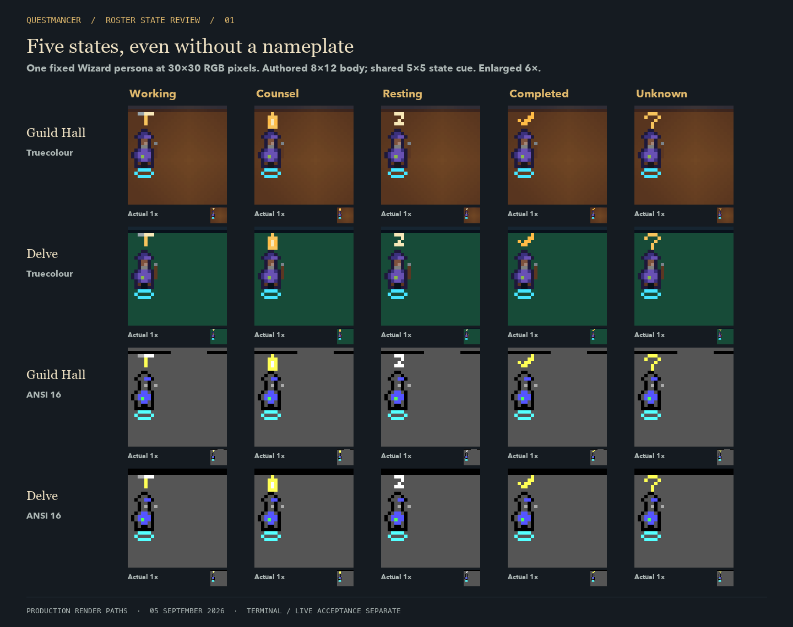

# Roster state review — 2026-09-05

Step 2b of [A party worth knowing](../../../plans/2026-09-05-party-delight.md).
The approved five shared state shapes are now wired into the production roster
renderer. The Questmancer visually approved all three production review
sheets on 2026-09-05. This accepts their state cues and compositions; it does
not constitute live terminal or Herdr acceptance.

## Review sheets

1. [Five state cues](01-state-cues.png): the same Wizard in working, counsel,
   resting, completed and unknown states at `30x30` RGB pixels. Both rooms,
   truecolour and ANSI 16, with nearest-neighbour enlargement and literal 1x
   insets. Shape carries the distinction when labels cannot fit.
2. [Completion deadline](02-completion-deadline.png): full-motion frames at
   0, 125, 250, 2999, 3000 and 6000 ms. Reduced and still examples keep the
   same completed cue throughout.
3. [Terminal layout](03-terminal-layout.png): current production overlays over
   six-adventurer parties at `60x30` and `30x48` RGB pixels, including ASCII
   and reconnecting examples. Labels use the space available; the state cues
   remain readable when a nameplate cannot fit.



## Behaviour under review

| Herdr presence | Persistent roster cue |
| --- | --- |
| Working | Tool with a horizontal head and vertical handle |
| Blocked | Counsel lantern |
| Idle | Resting Z |
| Done | Completed check |
| Unknown | Question mark |
| Exited | No live actor or actor hit region |

The body remains its authored `8x12` roster master. The shared `5x5` cue sits
above it. A fresh, explicit done transition adds four small gutter sparkles
at 8 fps in full motion. At three seconds the sparkles stop and the completed
check stays visible. This is a completion report, not test, merge or approval
acceptance. Reduced and still modes show the check with no decorative timer
or cleanup redraw.

A newer presence interrupts the return. Socket boundaries cancel old theatre,
while the original summons remains available for acknowledgement and history.
Reconnecting with retained done state cannot replay the return; a new done
transition after reconnection can start a new return.

State cues, the floor selection ring and two reserved rows of connection
pixels have separate space. Identity labels respect the cue and ring bounds,
including cells that contain an odd RGB boundary. ASCII labels use ASCII
separators, truncation and state symbols. Capacity, ordering and native body
hit regions keep the existing responsive contract.

The larger world masters and class-specific rituals belong to the subsequent
three-class pilot. The bodies in these sheets are the current production
roster families; this slice implements their shared state cues.

## Evidence and limits

Focused tests first reproduced state aliasing, missing Delve completion,
still-mode cleanup changes, stale/disconnected completion, labels covering
cues and selection, crowded-row collisions, and non-ASCII labels. Regression
coverage also checks ANSI 16 conversion, complete actor hits, reconnect
cancellation with summons preserved, and the real animation scheduler becoming
idle at the three-second deadline.

Final `just verify` passed on 2026-09-05: **542 Rust tests across 49 suites,
26 shell tests**, formatting, strict Clippy and script syntax. Review
regeneration, image layout inspection and `git diff --check` also passed.

The images use the production RGB painters and `flush_rgb` colour conversion.
The terminal-layout sheet uses final Ratatui `TestBackend` cells with current
identity labels and overlays. Half-block colours are reconstructed exactly;
text is typeset in Menlo for this document. These are fixture renders, not
screenshots from Ghostty or a live Herdr pane. The protocol has no synthetic
done report, so live completion still requires a real observed transition.
Native portrait transport and real-agent resting/completion acceptance remain
unreviewed. Product visual approval of these three sheets was recorded on 2026-09-05.

## Regenerate

Requires the repository Rust toolchain and Python with Pillow. The layout
script uses the macOS Avenir Next, Georgia and Menlo fonts.

```bash
REVIEW_PYTHON=/path/to/python-with-pillow \
  bash docs/design/reviews/2026-09-05-roster-states/regenerate.sh
```

[export.rs](export.rs) calls production rendering APIs;
[layout.py](layout.py) places their pixels into review documents.
[regenerate.sh](regenerate.sh) builds the current library, compiles the helper
against those exact artifacts, and owns its temporary files. It performs no
Herdr I/O and writes no persistent product state. Regenerating later reflects
later source; the checked-in sheets record this review's production rendering.
