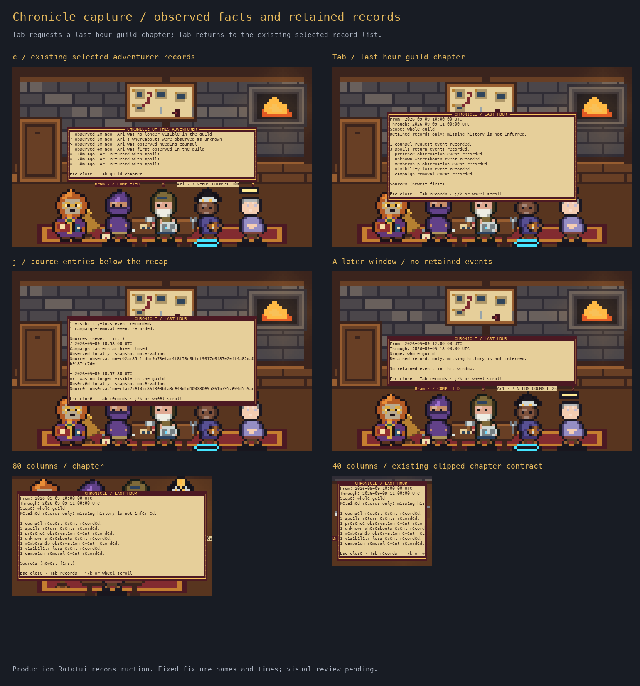

# Chronicle capture screen review

Status: visually approved by the user on 2026-09-09.



These are current production RGB scenes and Ratatui overlays reconstructed from
terminal cells with Menlo, using fixed fictional names/times and mixed legacy/v2
records. They are not native terminal screenshots. No room or class art changed.

- [Records](records.png): local observation ages and explicit unknown/visibility
  wording alongside unchanged legacy spoils wording.
- [Chapter](chapter.png): fixed UTC window, retained-history limit and separate
  presence, unknown, membership, visibility and campaign-removal counts.
- [Sources](sources.png): captured summaries, local-observation source labels and
  IDs; full IDs wrap at the existing full-width chapter boundary.
- [Empty window](empty.png): no retained events, without inferring missing history.
- [80 columns](compact.png) and [40 columns](narrow.png): existing width behaviour.
  Below 80 columns, chapter lines remain horizontally clipped; this slice does
  not change that documented contract.

Approval covers the new wording, readability and source presentation.
The reviewed images and their hashes are preserved unchanged; their original
“visual review pending” footer records the export stage, not the current status. Production art and
native transport acceptance from earlier releases are separate evidence.

Regenerate with a Python containing Pillow:

```bash
python3 docs/design/reviews/2026-09-09-chronicle-capture/regenerate.py
```

The exporter calls the production scene renderer, cell adapter and overlays.
`cells.json` retains exact cell content; `verification.json` records sizes and
image hashes. The [C3 receipt](../../../reviews/2026-09-09-chronicle-c3/README.md)
records automated and isolated synthetic qualification.
