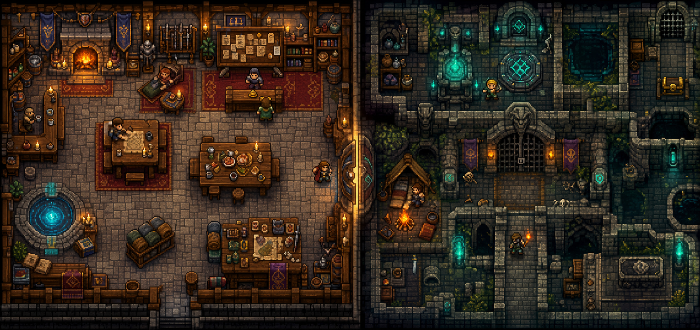

# Questmancer reference art

This directory contains approved visual-direction references. These images are
design targets, not production assets and not a promise that every depicted prop
will ship.

## Option A north star

Approved on 2026-07-17.

The image locks:

- two distinct authored scenes: the Guild Hall and the Delve;
- a fully scene-first interface with no permanent dashboard chrome;
- environment-dominant composition and compact adventurers;
- continuous architecture, dense material detail and environmental storytelling;
- warm amber Guild Hall lighting against cool teal Delve lighting;
- a 16-bit-era pixel-art character, furniture and tile vocabulary;
- restrained text and operational detail placed in overlays above the world.

It does not lock the exact furniture arrangement, room geometry, character
designs, props or generated pixels. Production art must be original,
terminal-legible and achievable through Questmancer's RGB framebuffer and
half-block renderer.

## Reference lineage

[Pixtuoid](https://github.com/IvanWng97/pixtuoid) is the reference for scene
density, tiny-character scale and the separation between a terminal-free RGB
scene painter and Ratatui's half-block terminal adapter. Questmancer must not
copy Pixtuoid's office layout, furniture, sprites, labels or product identity.

The north-star image was generated as an original Questmancer concept. Its brief
called for a cozy top-down adventurers' guild beside a connected old-school
dungeon, tiny adventurers embedded in both environments, crisp 16-bit-style
pixel art, full-canvas scenery, curated warm/cool lighting and no dashboard
panels, large characters, text, logos or copied assets.
